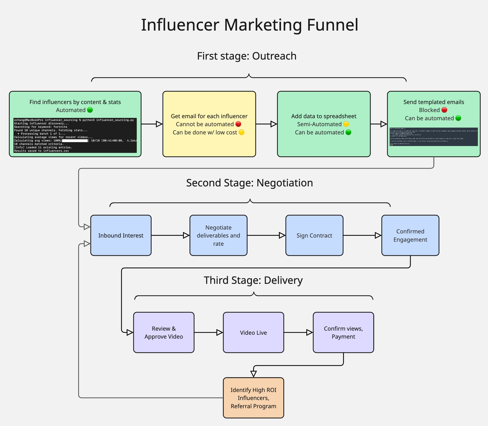

# influencer_outbound_automation
Used to automate cold outbound emailing for establishing contact with influencers.

## **Problem:** 
Influencer funnel can be broken into three main stages: Outreach, Negotiation, and Delivery. This doc is focused on stage one. The Outreach process is a numbers game, especially when expanding to new games, and is currently a bottleneck and draws time away from skilled tasks in latter stages. The current process is:
* slow & requires high manual labor on low skill, autonomize-able tasks
* not optimized for multiple people to work on outreach, leading to miscommunication

## **Solution:** 
Leverage google APIs + freelancers (optional) for low-cost automation of stage 1, freeing up time for stage 2 + 3. 

## **Ideal Workflow:**

## **⚙️Semi-Automated Workflow For Influencer Cold Outbound**
| Step | Tool | Manual or Automated? |
| ------------- | ------------- | ------------- |
| 1. Find influencers by content & stats | **influencer_sourcing.py** | ✅ Automated |
| 2. Add data to central spreadsheet | CSV import. Need Google Sheets + Drive API access to automate **influencers.csv** | ✅ Semi-automated |
| 3. Get email for each influencer | Human solves captcha - automation scope beyond this project | ❌ Manual |
| 4. Send templated emails | **email_send_concept.py** | ✅ Automated |

## Step 1: Find influencers by content & stats
Get a **YouTube Data API v3 key** and add it where noted in file
* Adjustments: Update params based on needs. For example, for a newer game like marvel rivals try:
    KEYWORDS = ["Marvel Rivals"] 
    MAX_RESULTS_PER_KEYWORD = 30
    SUBS_THRESHOLD = 1000
    VIEWS_THRESHOLD = 5000
* Run influencer_sourcing.py from command line. 
* Make sure you have influencers.csv in the same folder to write new entries
* This script finds channels with content [title, description, tags] containing your keywords (not case sensitive), that satisfy either subs OR views threshold

## Step 2: Add data to spreadsheet
* This is currently semi-automated. influencer_sourcing.py will automatically delete duplicates when creating an output csv - this can be used to create 1 deduplicated central source of truth of ALL outreach activity, past and current, so multiple people can coordinate outreach seamlessly. However, this will be stored locally, so you still need to copy/paste it to an online sheet for multiple people to work on the same sheet.
* Fully Automatic: gspread + Google Sheets API: enable Google Sheets API and Google Drive API, create Service Account credentials, update script to write to an online sheet.

## Step 3: Get email for each influencer
* This needs to be done manually (unless someone can make an automated captcha solver/integration)
* From the csv produced in step 1, go to channel > find email, fill in ‘email’ column w/ email
* If no email found, fill in other contact (Discord > Instagram > etc)
* This can be “human-automated” for a low cost - book a data-entry freelancer. or do it the old fashioned way

## Step 4: Send templated emails
* Use command line to run email_send_concept.py - takes in a file of format influencers.csv with emails filled out, which sends a personalized copy of above email to each name in list
* You can also alter the keywords and title to see how it affects the email
* Sender can dynamically set some fields; further customization is possible
     Game
     Creator references (game-specific)
     Offered CPM
* You will need to obtain a Gmail App password to use this method

**Future upgrades:**
* Move emails to separate text file and add more email templates, use jinja to render emails
* Create more switches; e.g. separate “Fortnite case1” vs “Fortnite case2”,
* Upgrade to oauth

